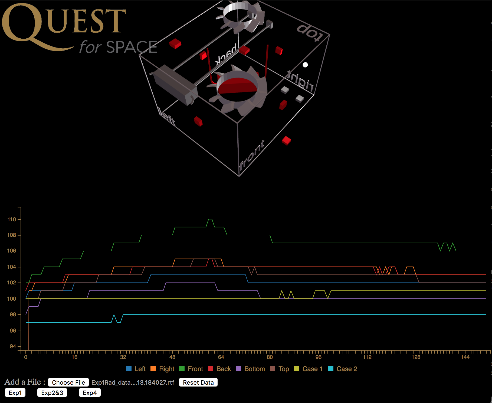

# satdatavis
explore visualizing satellite project data



## pre requisites
1. npm
2. a web server. You can run a light weight webserver called http-server if needed
3. webgl capable browser

## getting started
```bash
git clone repo
cd satdatavis
npm install
```

## code notes
- the scene units are non intuitive, I didnt spend a lot of time making the units from openscad match the ones in three.js but for maintenance sanity sake that could help
- use openscad to edit the models in scad form and export them to stl
